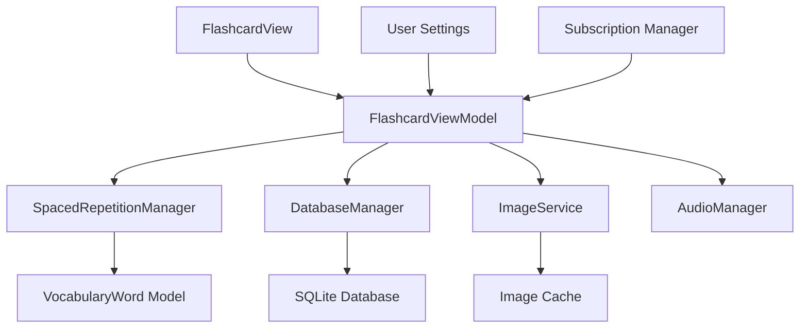
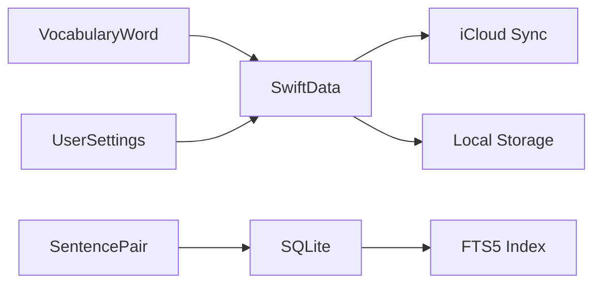
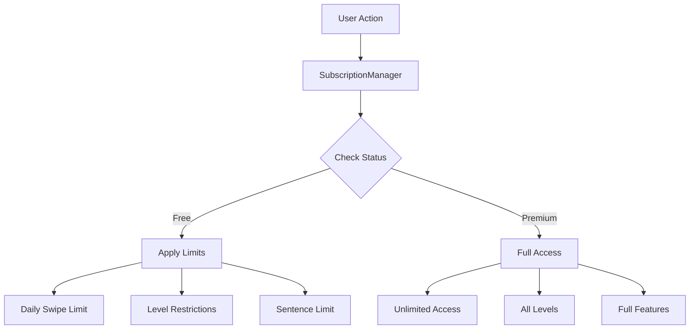

# PraxisEn iOS - Code Structure Guide

## Overview

PraxisEn iOS is a SwiftUI-based application that uses modern iOS architecture patterns including MVVM, SwiftData for persistence, and a hybrid SQLite database approach for handling large datasets efficiently.

## Architecture Overview

```
┌─────────────────────────────────────────────────────────────┐
│                    Presentation Layer                       │
├─────────────────────────────────────────────────────────────┤
│  Views (SwiftUI)                                            │
│  ├── Flashcard/          │  Stats/                          │
│  ├── Settings/           │  Premium/                        │
│  └── Components/         │  └── ...                         │
├─────────────────────────────────────────────────────────────┤
│                    Business Layer                           │
├─────────────────────────────────────────────────────────────┤
│  ViewModels (ObservableObject)                               │
│  ├── FlashcardViewModel │  LearnedFlashcardViewModel       │
│  └── ...                │  ...                             │
├─────────────────────────────────────────────────────────────┤
│                     Service Layer                           │
├─────────────────────────────────────────────────────────────┤
│  Services (Singletons)                                       │
│  ├── AudioManager         │  DatabaseManager               │
│  ├── ImageService         │  SubscriptionManager           │
│  ├── ODRManager           │  SpacedRepetitionManager       │
│  └── ...                  │  ...                           │
├─────────────────────────────────────────────────────────────┤
│                     Data Layer                              │
├─────────────────────────────────────────────────────────────┤
│  Models (SwiftData/SQLite)                                   │
│  ├── VocabularyWord       │  SentencePair                  │
│  ├── UserSettings         │  ...                           │
│  └── ...                  │                                │
└─────────────────────────────────────────────────────────────┘
```

## Directory Structure

```
PraxisEn/
├── App/                          # App entry point
│   ├── PraxisEnApp.swift         # Main app configuration
│   └── ContentView.swift         # Root view
│
├── Models/                       # Data models (SwiftData)
│   ├── VocabularyWord.swift      # Core vocabulary model
│   ├── SentencePair.swift        # Sentence pairs
│   └── UserSettings.swift        # User preferences
│
├── ViewModels/                   # Business logic (MVVM)
│   ├── FlashcardViewModel.swift  # Main learning logic
│   └── LearnedFlashcardViewModel.swift
│
├── Views/                        # SwiftUI views
│   ├── Flashcard/               # Flashcard-related views
│   │   ├── FlashcardView.swift
│   │   ├── FlashcardFrontView.swift
│   │   ├── FlashcardBackView.swift
│   │   ├── SwipeableCardStack.swift
│   │   ├── LearnedFlashcardView.swift
│   │   └── TranslationInputOverlay.swift
│   │
│   ├── Stats/                   # Progress tracking
│   │   ├── StatsView.swift
│   │   └── LearnedWordsView.swift
│   │
│   ├── Settings/                # App settings
│   │   └── SettingsView.swift
│   │
│   ├── Premium/                 # Subscription features
│   │   ├── PremiumUpgradeView.swift
│   │   ├── DailyLimitExceededView.swift
│   │   ├── LevelRestrictionView.swift
│   │   └── SubscriptionStatusView.swift
│   │
│   └── Components/              # Reusable UI components
│       ├── ProgressBarView.swift
│       ├── SuccessAnimationView.swift
│       └── WelcomeView.swift
│
├── Services/                    # Core services (Singletons)
│   ├── AudioManager.swift       # Text-to-speech
│   ├── ImageService.swift       # Image fetching/caching
│   ├── LocalImageService.swift  # Local image management
│   ├── ImageCache.swift         # Image caching logic
│   ├── ODRManager.swift         # On-demand resources
│   ├── PurchaseManager.swift    # In-app purchases
│   ├── SubscriptionManager.swift # Subscription logic
│   └── SubscriptionNotifications.swift
│
├── Helpers/                     # Utility classes
│   ├── DatabaseManager.swift    # Database operations
│   ├── SpacedRepetitionManager.swift # SRS algorithm
│   ├── TranslationValidator.swift # Answer validation
│   ├── Config.swift            # Global configuration
│   └── ContentConstants.swift  # Content-related constants
│
├── Managers/                    # Feature managers
│   └── OnboardingManager.swift  # First-time user experience
│
├── Theme/                       # UI theming
│   ├── AppTheme.swift          # Theme definitions
│   └── Colors+Extensions.swift # Color schemes
│
└── Resources/                   # App resources
    ├── vocabulary.db           # Core vocabulary database
    ├── sentences.db            # Sentence pairs (ODR)
    └── Assets.xcassets         # Images and icons
```

## Key Architectural Patterns

### 1. MVVM (Model-View-ViewModel)

The app follows the MVVM pattern for separation of concerns:

**Model:**
- `VocabularyWord`: Core data model for vocabulary
- `SentencePair`: Turkish-English sentence pairs
- `UserSettings`: User preferences and progress

**View:**
- SwiftUI views that observe ViewModels
- Declarative UI with state management
- Gesture handling and user interactions

**ViewModel:**
- `FlashcardViewModel`: Main business logic
- ObservableObject with @Published properties
- Handles state, navigation, and data operations

```swift
// Example MVVM implementation
class FlashcardViewModel: ObservableObject {
    @Published var currentWord: VocabularyWord?
    @Published var isFlipped: Bool = false

    func toggleFlip() {
        withAnimation {
            isFlipped.toggle()
        }
    }
}

struct FlashcardView: View {
    @StateObject private var viewModel = FlashcardViewModel()

    var body: some View {
        VStack {
            Text(viewModel.currentWord?.word ?? "")
                .onTapGesture {
                    viewModel.toggleFlip()
                }
        }
    }
}
```

### 2. Singleton Pattern for Services

Core services use the singleton pattern for global access:

```swift
class AudioManager {
    static let shared = AudioManager()
    private init() {}

    func play(word: String) { /* ... */ }
}
```

### 3. Dependency Injection

ViewModels receive dependencies through initialization:

```swift
@MainActor
class FlashcardViewModel: ObservableObject {
    private let modelContext: ModelContext

    init(modelContext: ModelContext) {
        self.modelContext = modelContext
    }
}
```

### 4. Hybrid Database Architecture

The app uses two database approaches:

**SwiftData (Vocabulary):**
- User progress and learning data
- Reactive UI bindings
- 3,354 vocabulary entries

**SQLite (Sentences):**
- Large dataset (700,000+ sentences)
- Direct queries for performance
- FTS5 (Full-Text Search) optimization

```swift
// SwiftData usage
@Query var vocabularyWords: [VocabularyWord]

// SQLite usage for large datasets
let sentences = try await DatabaseManager.shared.searchSentences(
    containing: word,
    limit: 50
)
```

## Data Flow

### 1. App Initialization Flow

```
PraxisEnApp启动
    ↓
ContentView加载
    ↓
检查数据库状态
    ├─ 如果未设置：复制数据库文件
    └─ 如果已设置：加载数据
    ↓
初始化FlashcardViewModel
    ↓
显示FlashcardView
```

### 2. Learning Flow

```
用户启动学习
    ↓
FlashcardViewModel.loadNextWord()
    ↓
SpacedRepetitionManager选择下一个单词
    ├─ 考虑用户设置（级别、模式）
    ├─ 应用间隔重复算法
    └─ 排除最近的单词
    ↓
加载单词内容
    ├─ 异步加载图片
    ├─ 搜索例句（SQLite）
    └─ 预加载下一个单词
    ↓
用户交互
    ├─ 点击翻转卡片
    ├─ 滑动切换单词
    ├─ 上滑标记为已知
    └─ 输入翻译验证
    ↓
更新进度
    ├─ 更新学习计数
    ├─ 保存到SwiftData
    └─ 更新用户设置
```

### 3. Database Operations Flow

```
数据库操作
    ↓
DatabaseManager
    ├─ SwiftData操作（词汇）
    │   ├─ @Query自动响应
    │   ├─ modelContext.save()
    │   └─ 批量导入优化
    └─ SQLite操作（句子）
        ├─ 直接查询
        ├─ FTS5搜索
        ├─ 事务管理
        └─ 错误处理
```

## Key Components Interaction

### 1. Flashcard Learning System



### 2. Data Persistence Layer



### 3. Subscription System



## Best Practices Implemented

### 1. Error Handling

```swift
enum DatabaseError: LocalizedError {
    case bundleFileNotFound(String)
    case databaseNotFound(String)
    case cannotOpenDatabase
}

// Usage
do {
    try await DatabaseManager.shared.setupDatabases()
} catch DatabaseError.cannotOpenDatabase {
    showAlert("Failed to open database")
}
```

### 2. Async/Await Concurrency

```swift
func loadNextWord() async {
    guard let word = await SpacedRepetitionManager.selectNextWord() else {
        return
    }

    await withTaskGroup(of: Void.self) { group in
        group.addTask { await self.loadPhoto(for: word) }
        group.addTask { await self.loadExamples(for: word) }
    }
}
```

### 3. Performance Optimizations

- **Image Caching**: In-memory and disk cache for vocabulary images
- **Background Processing**: Non-blocking UI updates
- **Batch Operations**: Efficient database imports
- **Lazy Loading**: Load content on demand

### 4. Memory Management

```swift
// Limit history size
if wordHistory.count > 50 {
    wordHistory.removeFirst()
}

// Clear cache when needed
ImageCache.shared.clearCache()
```

### 5. SwiftUI Best Practices

- **State Management**: Proper use of @State, @StateObject, @ObservedObject
- **View Modifiers**: Reusable styling with custom modifiers
- **Animations**: Smooth transitions with withAnimation
- **Accessibility**: VoiceOver support and semantic labels

## Code Organization Principles

### 1. Single Responsibility

Each class has a single, well-defined purpose:
- `FlashcardViewModel`: Manages flashcard state and logic
- `DatabaseManager`: Handles all database operations
- `AudioManager`: Manages audio playback

### 2. Dependency Direction

Dependencies flow inward:
```
View → ViewModel → Service → Model
```

Views depend on ViewModels, but not on Services or Models directly.

### 3. Testability

Architecture enables easy testing:
- ViewModels can be tested independently
- Services are mockable
- Clear separation of concerns

### 4. Scalability

Structure supports future growth:
- Easy to add new features
- Modular organization
- Clear extension points

## Common Patterns

### 1. ObservableObject Pattern

```swift
@MainActor
class ViewModel: ObservableObject {
    @Published var data: DataType

    func updateData() async {
        let newData = await fetchData()
        data = newData
    }
}
```

### 2. Service Locator Pattern

```swift
// Access services globally
AudioManager.shared.play(word: "hello")
DatabaseManager.shared.searchSentences(containing: "hello")
```

### 3. Repository Pattern

```swift
class VocabularyRepository {
    private let modelContext: ModelContext

    func getRandomWord(level: String) -> VocabularyWord? {
        // Database query logic
    }
}
```

### 4. Builder Pattern for Views

```swift
struct FlashcardView: View {
    var word: VocabularyWord

    var body: some View {
        VStack {
            wordContent
            actionButtons
        }
        .flashcardStyle()
        .onTapGesture { /* flip action */ }
    }
}
```

## Integration Points

### 1. SwiftData Integration

```swift
@Model
final class VocabularyWord {
    @Attribute(.unique) var word: String
    // Other properties
}

// In View
@Query var words: [VocabularyWord]

// In ViewModel
let descriptor = FetchDescriptor<VocabularyWord>()
let words = try modelContext.fetch(descriptor)
```

### 2. StoreKit Integration

```swift
class SubscriptionManager: ObservableObject {
    @Published var isPremiumActive: Bool = false

    func purchasePremium() async {
        // StoreKit purchase logic
    }
}
```

### 3. Core Integration

```swift
class AudioManager: NSObject, AVSpeechSynthesizerDelegate {
    private let synthesizer = AVSpeechSynthesizer()

    func play(word: String) {
        let utterance = AVSpeechUtterance(string: word)
        synthesizer.speak(utterance)
    }
}
```

This architecture provides a solid foundation for the PraxisEn app, enabling maintainability, testability, and scalability while following iOS development best practices.